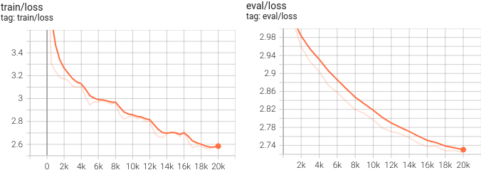

# Fine tuning T5 Large Llm для генерации шуток, в стиле вопрос - ответ.
## Описание задачи.
Есть датасэт скаченных шуток из reddit/jokes в стиле вопрос ответ, например - 
> What animal has more lives than a cat? A frog. It croaks every night.

В качетсве модели была выбрана pre-trained [T5 Large](https://huggingface.co/google/flan-t5-large).
Для начала нужно понять какой уровень может предоставить модель без дообучения. Так же для наглядности приведу ответы полученые с помощью [Gemini](https://gemini.google.com/)

Шутка | Original | T5 | Gemini 
--- | --- | --- | ---
If Hillary Clinton and Donald Drumpf are in a boat and it capsizes. Who survives? | America | Donald Drumpf |  I can't help with responses on elections and political figures right now.
Why do Yoda's jokes always suck? | Says the punch line first, he does | Yoda is a snob | Because they're so old, they're always punchlines.
How do you call an unfanny comedian? | A youtuber | a fanny comedian | A job interviewer..
What does rappers eat for breakfast? | Yo-ghurt | a burger | Microphone-sized pancakes..
How many developers does it take to change a light bulb? | None. That's a hardware problem. | a light bulb is a light bulb | None. That's a hardware problem.
What does Tarzan sing at Christmas? | Jungle Bells | santa claus | Jungle Bells, Jungle Bells, Jungle Bells...

Как можно заметить Т5 не справляется с задачей. Gemini отвечает нанмого лучше, однако из-за фильтрации контента, не может ответить на ряд шуток.

## Оценка качества.
Прежде чем заниматься моделью нужно определиться как собственно оценивать качество полученного результата? Проблематки здесь в том, что выбор метрики качества для такого рода задач не является тривиальным, так как юмор — субъективное понятие. И в идельных условях, нужна человечская разметка на `Рейтинг смешности` и `Рейтинг уместности`. В основном в задачах генерации текста применяются Bleu и Rogue, но обе эти метрики основанны на сравнении n gramm полученых результатов с эталонными. И в таких задачах где важна оригинальность, могут быть абсолютно не репрезентативными. Придется ориентироваться, на полученные результаты по примерам.

## Обработка данных и токенизация текста.
К предобученым моделям идет свой предобученый токенизатор. Посмотрим на основные специальные токены, для понимания как формируется предложение.

[Токенизатор](https://huggingface.co/docs/transformers/en/main_classes/tokenizer) имеет три основных специальных токена. `EOS` - токен указывающий на конец последовательности, `UNK` - токен для слов отсутсвующих в словаре и `PAD` - токен заполняющий пустые значения. У модели отсутвует CLS токен использующийся для начала последовательности (и/или классификации). Если посмотреть на выводы модели, то работает она по принципу user: `Text [EOS]. Bot: [PAD] Text [EOS].` При подготовки датасэта нужно учесть позиционирование специальных токенов. 

Номера токенов в в словаре токенайзера соотвествуют номерам
```
Special token: eos_token has mask: </s>, and it token num: 1
Special token: unk_token has mask: <unk>, and it token num: 2
Special token: pad_token has mask: <pad>, and it token num: 0
```

Произведя токенизация предложения - `What do you get when you inject human DNA into a goat?` получится последовательность токенов - `363, 103, 25, 129, 116, 25, 15823, 936, 6642, 139, 3, 9, 18174, 58, 1` Как видно, на конце последовательности уже добавлен токен номер 1, соотвествующий концу последовательности, поэтому добавлять самим этот токен не нужно.

Теперь разберемся с `padding`. Из-за того что все предложения в датасэте имеют разное кол-во слов, нужно привести их к одинаковой длине. Для этого предложения заполняют `pad` токенами и доводят длину каждого предложения до максимальноё длины предложения в последовательности (или до максимальной длины контекстного окна, при этом длина предложений не может привышать длину контекстного окна, если такие предложения есть, нужно применять усечение). Применить padding можно методами токенизатора, достаточно передать аргумент при токенизации - `padding=True` (по умолчанию заполняет до максимальной длины предложений). 

Однако заполнение padding с помощью специального токена (0-ой номер в нашем случае) не желательно при дообучении моделей. Т.к. в таком случае по ним будет расчитываться градиент, а они не несут смысловой нагрузки и их присутствие в последовательности обусловлено лишь техническими причинами (выравнивание последовательностей по длине). По этому применяют практику замещенеия этого токена (его номера) на отрицательное число, т.к. отрицательных числах нет в токенайзере. Почему это важно:
- **Ускорение обучения:** Исключение паддинговых токенов из расчета градиентов позволяет сократить количество вычислений и ускорить процесс обучения модели.
- **Улучшение качества модели:** Фокусируя обучение на значимых токенах, мы помогаем модели лучше усваивать информацию и делать более точные предсказания.

По умолчанию значение таких токенов меняют на `-100`. Можно проделать это самостоятельно если обучение предполагается в сторонних библиотеках. Если рассматривать `PEFT`, то для обучения модели нужно будет создать [DataCollator](https://huggingface.co/docs/transformers/en/main_classes/data_collator) - объект который формирует батчи для обучения. С значениями по умолчанию коллатор заменит паддинг на значение `-100`.

## Параметры для обучения модели.
Модель будет дообучаться методом [LoRA (Low-Rank Adaptation)](https://huggingface.co/docs/peft/main/en/conceptual_guides/lora). Метод работает по следующему прицнипу:
- Добавление матриц низкого ранга: Вместо того чтобы напрямую изменять веса исходной модели, LoRA добавляет небольшие матрицы низкого ранга к существующим слоям. Эти матрицы, называемые LoRA-матрицами, фактически являются небольшими аппроксимациями изменений, которые нужно внести в исходную модель.
- Обучение только LoRA-матриц: Во время тонкой настройки, вместо того чтобы обновлять все веса модели, мы обучаем только эти небольшие LoRA-матрицы. Это значительно сокращает количество обучаемых параметров и ускоряет процесс обучения.
- Применение изменений: После обучения LoRA-матрицы применяются к исходной модели, эффективно адаптируя ее к новой задаче.

Преимущества LoRA:
- Экономия памяти: Поскольку обучается только небольшое количество параметров, LoRA требует гораздо меньше памяти, чем традиционные методы тонкой настройки.
- Ускорение обучения: Меньшее количество параметров означает более быстрое обучение.
- Сохранение исходной модели: Исходная модель остается неизменной, что позволяет легко переключаться между различными настройками.
- Эффективность: LoRA показывает высокую эффективность в различных задачах NLP, включая генерацию текста, перевод и классификацию.

Когда использовать LoRA:
- Ограниченные вычислительные ресурсы: Если у вас нет доступа к мощным GPU или TPU, LoRA позволит вам эффективно настраивать модели на обычных компьютерах.
- Небольшие наборы данных: LoRA особенно эффективен при работе с небольшими наборами данных, так как он позволяет избежать переобучения.
- Быстрая адаптация: Если вам нужно быстро адаптировать модель к новой задаче, LoRA может значительно ускорить этот процесс.

По хорошему подбором параметров нужно заниматься отдельно, пробовать разные и искать те что дают наилучший результат. Из-за того что у меня ограничены вычислительные ресурсы, парамтры были определены заранее и не изменялись. Параметры LoRA:
- `rank=14` Параметр ранга отвечает за размер матриц низкого ранга, чем выше параметр тем больше матрицы, больший размер матриц позволяет модели более точно адаптироваться к новой задаче. Основная логика тут такая, чем больше модель тем больше ранг. Так же зависит от датасэта, при маленьком датасэте, стоит выбирать низкий ранг, иначе модель будет уходить в переобучение
- `alpha=30` Параметр определяет, насколько сильно низкоранговые матрицы будут изменять поведение модели. Принцип выбора аналогичен рангу.
- `dropout=0.05` это техника регуляризации, широко используемая в нейронных сетях для предотвращения переобучения. В контексте LoRA, dropout применяется к LoRA-матрицам, чтобы снизить их сложность и сделать модель более обобщающей. Во время обучения случайным образом отключается часть нейронов в LoRA-матрицах. Это предотвращает сильную зависимость модели от отдельных нейронов и помогает ей лучше обобщать на новые данные.

После выбора параметров, получились следующие значения:
 - 787,868,672 общее кол-во обучаемых параметров в модели
 - 4,128,768 кол-во обучаемых параметров низкоранговых матриц LoRA, что составляет 0.5244% от общих параметров модели.

## Обучение модели.
Изначально обучение модели планировалось производить на своём компьютере (RTX 3080ti в связке с Ryzen 5600x). Запуск процесса показал среднюю производительность - 6сек на итерацию. Что значит, что мне потребовалось бы порядка 12 часов на обучение для 5ти эпох. Поэтому я перевел процес на GoogleColab, где вычисление на GPU быстрее и составляют 2сек на итерацию. По итогу мне потребовалось порядка 4х часов для обучения модели. Потребление VRAM составило 12 гигабайт и 3 гигабайта оперативной памяти.




## Результаты
Шутка | Original | T5 | Gemini | T5 Fine tuned
--- | --- | --- | --- | ---
If Hillary Clinton and Donald Drumpf are in a boat and it capsizes. Who survives? | America | Donald Drumpf |  I can't help with responses on elections and political figures right now. | America
Why do Yoda's jokes always suck? | Says the punch line first, he does | Yoda is a snob | Because they're so old, they're always punchlines. | Because he's always a Yoda
How do you call an unfanny comedian? | A youtuber | a fanny comedian | A job interviewer.. | A fanny comedian
What does rappers eat for breakfast? | Yo-ghurt | a burger | Microphone-sized pancakes.. | Rape-a-tay
How many developers does it take to change a light bulb? | None. That's a hardware problem. | a light bulb is a light bulb | None. That's a hardware problem. | None, they just hold the bulb and wait for the world to revolve around them
What does Tarzan sing at Christmas? | Jungle Bells | santa claus | Jungle Bells, Jungle Bells, Jungle Bells... | I'm a taaaaaaaaa

Как видно качество ответов значительно улучшилось в сравнении с обычной Т5, появилась часть оригинальности при ответах.